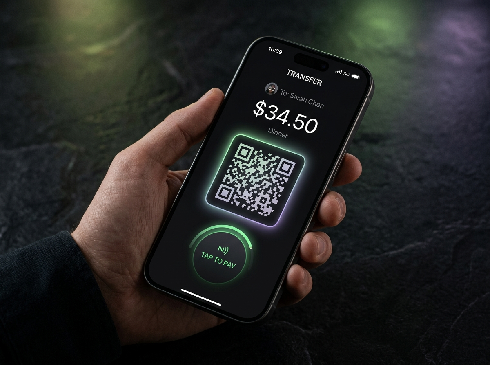

# 🧉 MatePay

Pagá y cobrá en dólares digitales (USDC) sobre Solana, con QR y alias.

Prototipo hecho en la **Hackathon Solana x Superteam Argentina**.

## Qué hace
- **Comercio (POS):** ingresa el monto en pesos, la app lo convierte a USDC y genera un QR de Solana Pay.
- **Cliente:** escanea el QR o escribe un alias (ej. `@cafemartinez`) y confirma el pago.
- **Sin SOL:** un fee-payer cubre las comisiones de red.

## Estado
Prototipo en **Devnet**. El flujo de pago es una simulación para mostrar la experiencia de usuario.

## Stack
React, TypeScript, Vite, Tailwind, Express, `@solana/web3.js`, `@solana/spl-token`.

## Cómo correrlo
**Requisito:** Node.js

1. Instalá las dependencias:
   `npm install`
2. Copiá `.env.example` a `.env` y completá las variables, como `GEMINI_API_KEY`.
3. Corré la app:
   `npm run dev`

## Equipo
Juan Pablo Gerez, Mauricio Montero, Máximo Robles
